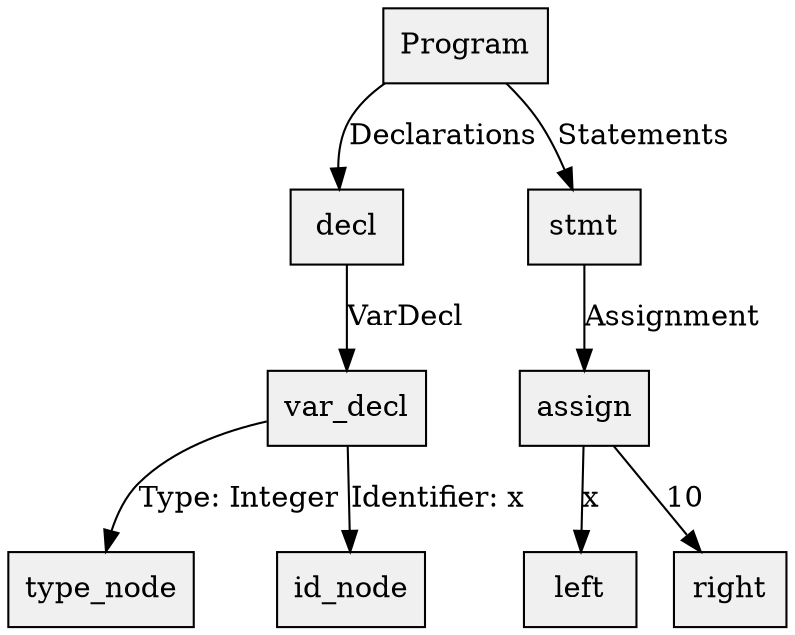

# AST可视化工具推荐
1. **Graphviz（首选工具）**
• 核心功能：基于DOT语言描述树形结构，支持自动布局生成高质量的矢量图（SVG/PDF/PNG）。

• macOS安装：

  ```bash
  brew install graphviz  # 通过Homebrew一键安装（推荐）
  ```
• 优势：开源跨平台，语法简洁，支持复杂树形结构的层级展示和样式定制。


2. **Code2Flow（替代方案）**
• 适用场景：专为代码分析设计，可自动生成函数调用图和类继承树，支持Python/JS/Ruby等语言。

• 安装与使用：

  ```bash
  pip install code2flow
  code2flow your_ast.json --output ast_graph.png
  ```
• 特点：基于AST解析，支持深度过滤（如`--downstream-depth=3`指定遍历层级）。


3. **IDE集成工具**
• Lazarus：基于Free Pascal的跨平台IDE，内置调试器支持AST可视化（需结合调试插件）。

• VS Code扩展：如`vscode-language-pascal`，提供语法树预览和交互式调试功能。


---

二、Graphviz的DOT语言语法（AST树示例）
1. **基础树结构语法**

• 节点定义：`node`定义全局样式，`root`/`decl`等为自定义节点。

• 边关系：`->`表示父子关系，`label`添加注释。


2. **高级特性**
• 子图（Subgraph）：分组展示复杂子树：

  ```dot
  subgraph cluster_vars {
    label="Variables";
    var1; var2;
  }
  ```
• 样式定制：通过属性调整颜色、形状：

  ```dot
  node [color="blue", fontname="Courier"];
  edge [arrowhead=vee, penwidth=2];
  ```

---

三、结合Pascal2C工具生成AST
若使用`Pascal2C`转换工具，需在转换流程中导出AST中间表示：
1. AST生成：工具解析Pascal源码后生成JSON/XML格式的AST文件。
2. 格式转换：编写脚本将AST转换为DOT格式，例如递归遍历节点生成父子关系。
3. 自动化管道：
   ```bash
   pascal2c input.pas --ast-output=ast.json
   python ast_to_dot.py ast.json > ast.dot
   dot -Tpng ast.dot -o ast.png
   ```

---

四、其他注意事项
1. 性能优化：大型AST可启用Graphviz的`sfdp`布局引擎加速渲染：
   ```bash
   sfdp -Goverlap=prism -Tsvg ast.dot > ast.svg
   ```
2. 交互式工具：使用`Gephi`或`Vis.js`实现动态缩放和节点过滤。
