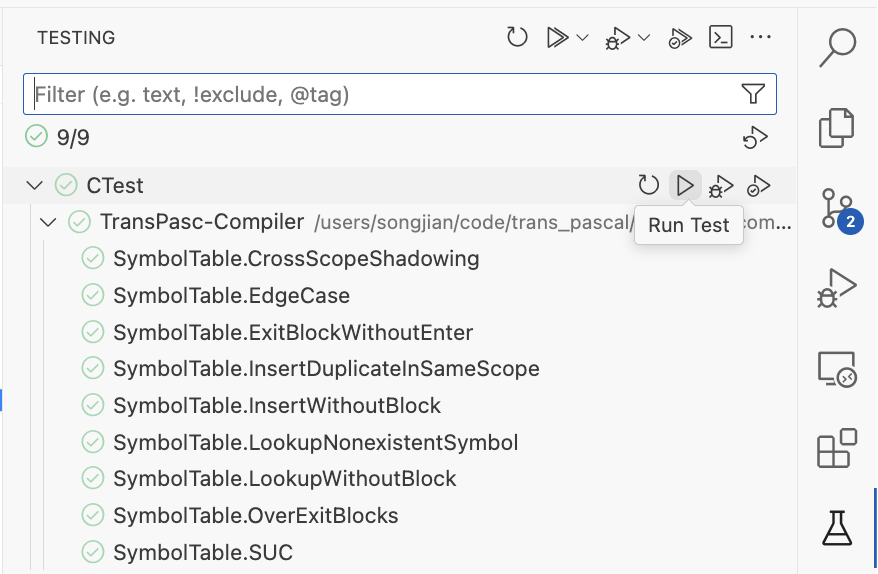

# 开发流程

## 准备工作

### 开发环境
- cmake
- flex & bison
- g++
- vscode
- git
- free pascal compiler
- python 3

### clone git 仓库
```sh
git clone git@github.com:TransPasc/TransPasc-Compiler.git
```
### 安装 Pre-commit
[详情看这里](./pre-commit.md)
### 编译
安装 Vscode CMake插件，直接点击`build`即可

或者在vscode `launch.json`中配置，并在`RUN AND DEBUG`中选中后直接点击`F5`

参考样例如下
```json
{
  "version": "0.2.0",
  "configurations": [
    {
      "name": "Launch Main Program",
      "type": "cppdbg",
      "request": "launch",
      "program": "${workspaceFolder}/build/kpc",
      "args": [
        "-i",
        "/Users/songjian/code/trans_pascal/TransPasc-Compiler/build/test.pas",
      ],
      "stopAtEntry": false,
      "cwd": "${workspaceFolder}/build",
      "environment": [],
      "externalConsole": false,
      "MIMode": "lldb",
      "preLaunchTask": "cmake: build"
    },
  ]
}
```

### 测试

#### 单元测试
直接在 vscode `Testing`中点击运行即可


若要 Debug, 还需配置`launch.json`
```json
{
  "version": "0.2.0",
  "configurations": [
    {
      "name": "Debug GTest (Auto)",
      "type": "cppdbg",
      "request": "launch",
      "program": "${command:cmake.launchTargetPath}",
      "args": [],
      "stopAtEntry": false,
      "cwd": "${workspaceFolder}",
      "environment": [],
      "externalConsole": false,
      "MIMode": "lldb",
      "preLaunchTask": "cmake: build"
    }
  ]
}
```
#### 集成测试

通过命令运行
```sh
python3 tests/black-box/run-gencode.py tests/black-box/generate/ build/tmp
```

或者配置`launch.json`, 选中后通过`F5`运行

参考配置如下:

```json
{
  "version": "0.2.0",
  "configurations": [
    {
      "name": "Run Integrated Test",
      "type": "debugpy",
      "request": "launch",
      "program": "${workspaceFolder}/tests/black-box/run-gencode.py",
      "cwd": "${workspaceFolder}",
      "args": [
        "${workspaceFolder}/tests/black-box/generate/",
        "${workspaceFolder}/build/tmp"
      ],
      "console": "integratedTerminal",
      "justMyCode": true
    }
  ]
}
```

## 开始开发

从 `/dev/vx.x`(`x.x`为版本号)分支创建新分支，参考新命名例子`/dev/v0.0/<$your_name>`

在新分支上工作，并解决集成测试/单元测试中的bug

同步到 github 上自己的分支。

开发完成后，git pull `dev/vx.x`的最新提交，并 rebase, 具体操作[参考这](https://bupt.online/tech/github%20%E5%B7%A5%E4%BD%9C%E6%B5%81.html#init)

解决冲突后，在 github 上提交 **PR**

经过两名以上的`该功能开发者`审核同意后，由`该功能拥有者`合并该 PR(注意是 squash and merge)

删除自己的远程分支和本地分支

## 项目说明
### 目录结构
```text
.
├── CMakeLists.txt # cmake配置文件
├── README.md # 项目说明入口
├── TODO.md # TODO列表
├── cmake # CMake辅助配置
├── docs # 文档
├── include # 头文件
│   ├── ast # 抽象语法树
│   ├── cli # 命令行
│   ├── codeGenerate # 代码生成
│   ├── driver.h # 编译器驱动
│   ├── err.hpp # 自定义错误
│   ├── menu # 菜单
│   ├── scanner.h # 词法分析
│   ├── semanticAnalysis # 语义分析
│   └── symbolTable # 符号表
├── src # 源文件
│   ├── ast
│   ├── cli
│   ├── codeGenerate
│   ├── driver.cpp
│   ├── main.cpp # 程序入口
│   ├── menu
│   ├── parser.y # Bison 文件
│   └── scanner.l # Flex 文件
├── tests # 测试目录
│   ├── CMakeLists.txt
│   ├── benchmark # 性能测试
│   ├── black-box # 黑盒测试/单元测试
│   └── unit # 单元测试
```

### AST 命名规范
对应产生式`ProductionName := X1 X2 ...`其对应的 AST 应该命名为 `$ProductionNameNode_X1_X2_...`

对于空产生式`ProductionName := {}`,对应的类名为`ProductionNameNode`

所有的`ProductionNameNode_X1_X2_`继承于`ProductionNameNode`

例如

```c
expression_list :
    expression {
        $$ = std::make_shared<ExpressionListNode_Expression>($1, @1.begin.line);
    } |
    expression_list COMMA expression {
        $$ = std::make_shared<ExpressionListNode_ExpressionList_Comma_Expression>(
            $1, $2, $3, @1.begin.line);
    }
```
对于
`expression_list := expression_list COMMA expression`
其对应的 AST类名为`ExpressionListNode_ExpressionList_Comma_Expression`

#### Notice
添加新的 AST类后，应该在`visitor.h`中添加对应的访问函数,
例如
```cpp
dispatch(TerminalNode);
```
或者旧的写法（不推荐）
```c
virtual void visit(class TerminalNode &node) = 0;
```

当然，你得在所有继承于`ASTVisitor`的类中`override`并实现新增的访问方法
